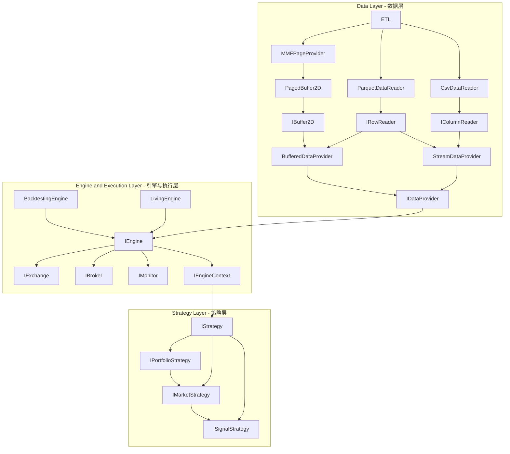

# CarrotQuant .NET v4 架构规范文档

## 一、系统架构总览 (v4 Software Architecture)

CarrotQuant.NET v4 采用 **三层分离架构**，各层之间通过接口契约解耦，支持回测与实盘双引擎。

### 架构图



### 分层说明

#### 1. Data Layer（数据层）

负责数据的获取、转换和供给，核心组件：

| 组件 | 职责 |
|------|------|
| **ETL** | 数据抽取/转换/加载的入口 |
| **MMFPageProvider** | 基于内存映射文件的分页数据提供器 |
| **ParquetDataReader** | Parquet 格式数据读取器 |
| **CsvDataReader** | CSV 格式数据读取器 |
| **PagedBuffer2D** | 二维分页缓冲区，实现 `IBuffer2D` |
| **IRowReader / IColumnReader** | 行/列数据读取抽象接口 |
| **BufferedDataProvider** | 缓冲模式数据提供器（全量加载） |
| **StreamDataProvider** | 流式数据提供器（按需读取） |
| **IDataProvider** | 数据层统一输出接口，供引擎层消费 |

#### 2. Engine and Execution Layer（引擎与执行层）

驱动回测或实盘运行的核心调度层：

| 组件 | 职责 |
|------|------|
| **IEngine** | 引擎统一抽象接口（含状态监控、执行控制、持久化） |
| **BacktestingEngine** | 回测引擎实现 |
| **LivingEngine** | 实盘引擎实现 |
| **IEngineContext** | 引擎运行上下文，向策略层注入数据（Data, Broker, Market） |
| **IExchangeGateway** | 交易所网关抽象（屏蔽回测模拟器与真实交易所差异） |
| **IMatchingEngine** | 撮合引擎接口（仅回测，驱动时间步撮合） |
| **IBroker** | 经纪人/账户管理抽象（资产查询、订单管理、成交事件） |
| **IMonitor** | 监控/日志/告警抽象 |

**数据流向**: `IDataProvider` → `IEngine` → (`IExchange` / `IBroker` / `IMonitor`) → `IEngineContext` → 策略层

#### 3. Strategy Layer（策略层）

策略的分层执行管线，依赖 `IEngineContext` 注入：

| 组件 | 职责 |
|------|------|
| **IStrategy** | 策略基础接口，包含完整生命周期（Initial/Start/Update/Stop）及事件（Order/Position） |
| **IStrategyPipeline** | 策略管线接口，支持 Add/Compile 组合模式 |
| **IPortfolioStrategy** | 组合/仓位管理策略（逻辑角色） |
| **IMarketStrategy** | 市场/宏观策略（产生 MarketBias） |
| **ISignalStrategy** | 个股信号策略（Alpha 信号生成） |

**策略调度链**: `IPortfolioStrategy` → `IMarketStrategy` → `ISignalStrategy`

### 3.1 策略解耦：Context 黑板模式
核心理念是通过 `IEngineContext` 作为统一的信息交换中心（黑板），实现不同职责策略间的无感协作与物理隔离：
- **职责分层**: 
    - **信号发生器**: 仅负责行情分析与信号生产（Signal Generation），输出结论至上下文，不触碰交易接口。
    - **执行处理器**: 仅负责监听黑板上的信号并转化为物理订单（Order Placement），对信号来源无感知。
    - **风控监察员**: 监听账户回报（ExecutionReport/PositionEvent），实时执行风险对冲或合规校验。
- **松耦合机制**: 策略间通过“A 生成状态 -> Context 存储 -> B 消费状态”的模式运行，这种基于状态的异步通信机制，使得单一策略可以保持极简逻辑并支持自由组合。

### 3.2 策略管线 (Pipeline)
基于组合模式（Composite Pattern）构建，支持复杂策略逻辑的拓扑编排：
- **串联管线 (Sequential)**: 逻辑按序执行，适用于有因果依赖的策略链。例如：`宏观策略` → `个股信号` → `执行策略`。
- **并联管线 (Parallel)**: 逻辑并发执行，适用于相互独立、计算密集型的策略组，充分利用多核性能。
- **编译优化**: 引擎启动前通过 `Compile()` 对管线拓扑进行密封优化，确保在每个时间步分发事件时的执行效率。

---

## 二、市场策略 (IMarketStrategy) 体系

### 1. RaUA 架构管线
- **IMarketStrategy** 产生的宏观决策将通过 `context.Market` 注入到个股扫描 (`ISignalStrategy`) 和交易执行的上下文中。
- **MarketBias** (市场偏向) 定义：
    - `Up`: 看多 / 活跃
    - `Neutral`: 中性
    - `Down`: 看空 / 冰点

### 2. 决策消费与剪枝
- **剪枝机制**: 引擎在执行 ISignalStrategy 前会检查 `context.Market` 的状态。若 `MarketContext.SkipAlpha` 为 `true`，将自动跳过当日所有个股的信号计算。
- **状态访问**: 策略可以通过 `context.Market.GetState<T>()` 获取由 `IMarketStrategy` 计算并存储的强类型自定义状态数据。
  - 示例：`var metrics = context.Market.GetState<MyMarketMetrics>();`

---

*架构基石：通过在数据层承担复杂度（对齐），实现了计算层与分析层逻辑的极简归一。*

## 三、数据层契约 (Data Layer Contracts) [v4]

本章节定义 v4 数据层的核心接口契约，所有接口位于 `CarrotBacktesting.NET` 项目的 `Abstraction/` 目录下。
引擎层与策略层**禁止**绕过这些接口直接访问物理存储。

### 1. 物理层抽象：宽表快照流（ETL 层）

命名空间：`CarrotBacktesting.NET.Abstraction.Data.Etl`

| 接口 | 文件 | 职责 |
|------|------|------|
| `IMarketSnapshotMetadata` | `Abstraction/Data/Etl/IMarketSnapshotSource.cs` | 描述数据源的维度结构（Symbols / FieldNames / 字段类型） |
| `IMarketSnapshotSource` | `Abstraction/Data/Etl/IMarketSnapshotSource.cs` | 流式读取宽表快照的 ETL 契约，屏蔽 CSV / Parquet 物理格式细节 |

**关键设计**：
- `MoveNext()` 驱动逐行（逐交易日）遍历，零状态暴露。
- `ReadFieldSnapshot<T>(fieldName, Span<T> destination)` 直接写入调用方提供的内存块，**严格零拷贝**，禁止内部 `new T[]`。
- `T : unmanaged` 约束确保与 `Carrot.Memory` 的 MMF 物理布局兼容。

### 2. 内存层接口：对齐后的 Buffer 访问（Data 层）

命名空间：`CarrotBacktesting.NET.Abstraction.Data`

| 接口/类型 | 文件 | 职责 |
|-----------|------|------|
| `IMarketMetadata` | `Abstraction/Data/IMarketMetadata.cs` | 全局对齐后的维度信息：TradeDates（行索引）、Symbols（列索引） |
| `IDataProvider` | `Abstraction/Data/IDataProvider.cs` | 数据层统一输出入口，`GetBuffer<T>(fieldName)` 返回 `IReadOnlyBuffer2D<T>` |
| `IFieldRegistry` | `Abstraction/Data/IFieldRegistry.cs` | 字段注册表，管理已加载字段的元信息（含自定义指标字段） |
| `IEventProvider<T>` | `Abstraction/Data/IEventProvider.cs` | 异构 KV 数据提供器（复权因子、分红、公告等） |
| `IEventRegistry` | `Abstraction/Data/IEventRegistry.cs` | 事件注册表，统一管理外部 KV 数据流 |
| `FieldInfo` | `Abstraction/Data/IFieldRegistry.cs` | 字段元数据 record（Name, DataType, IsCustom） |

**关键约束**：
- `IDataProvider.GetBuffer<T>()` 返回类型必须为 `IReadOnlyBuffer2D<T>`（来自 `Carrot.Memory`），**禁止**返回可写 Buffer。
- `IMarketMetadata.Symbols` 顺序与 Buffer **列索引**严格对齐；`TradeDates` 顺序与 Buffer **行索引**严格对齐。
- 所有接口均不暴露 `List<T>`、`T[]` 等分配内存的集合类型供外部持有。

### 3. 依赖关系

```
IMarketSnapshotSource  ──(ETL Loader 写入)──►  IBuffer2D<T>  [Carrot.Memory]
                                                      │
                                              (只读封装后)
                                                      ▼
                                          IReadOnlyBuffer2D<T>  [Carrot.Memory]
                                                      │
                                         IDataProvider.GetBuffer<T>()
                                                      │
                                              EngineLayer / StrategyLayer
```

### 4. Carrot.Memory 依赖说明

- 项目引用：`D:\Projects\Carrot.Memory\Carrot.Memory\Carrot.Memory.csproj`（已在 `CarrotBacktesting.NET.csproj` 中声明）
- 关键类型：`IReadOnlyBuffer2D<T>`、`IBuffer2D<T>`、`ReadOnlyRowView<T>`、`ReadOnlyColumnView<T>`
- 命名空间：`Carrot.Memory.Abstractions`、`Carrot.Memory.Views`

### 5. 异构事件流系统 (Event System)

为了处理复权因子、龙虎榜、分红、财报、停牌公告等异构 KV 数据，v4 引入了事件流抽象。系统将数据分为两类，采用不同的物理实现与优化路径：

#### 5.1 稠密矩阵 (IDataProvider) vs 稀疏事件 (IEventRegistry)

| 特性 | **IDataProvider (稠密数据/矩阵)** | **IEventRegistry (稀疏数据/KV)** |
| :--- | :--- | :--- |
| **物理属性** | 连续内存块 (Memory-mapped / Buffer) | 键值对字典、对象图、链表 |
| **访问模式** | 全量、批量、按索引 (row, col) 访问 | 随机、点对点访问 (date, symbol) |
| **应用场景** | 向量化计算（RSI、MACD、因子合成） | 决策分支（是否停牌？是否有分红？） |
| **一致性要求** | **强对齐**。必须保证日期与股票严格对齐，缺失会导致矩阵逻辑错位。 | **弱对齐**。仅在事件发生时存在记录，无需强行补全。 |
| **性能目标** | **吞吐量 (Throughput)**。优化目标是跑满 SIMD 指令集。 | **延迟 (Latency)**。优化目标是 O(1) 或 O(log n) 的快速查找。 |

#### 5.2 核心接口

- **IEventProvider<T>**: 负责加载和供给特定类型的 KV 数据。支持按 (Date, Symbol) 随机访问，或获取全市场日快照。
- **IEventRegistry**: 引擎全局唯一的事件流注册中心。策略通过 `context.Events.GetProvider<T>("stream_name")` 获取所需的数据流。

**设计优势**：
- **异构支持**: 不同数据流可以有完全不同的结构（Record 类型）。
- **加载解耦**: 各数据流可以有不同的数据源（Parquet, SQL, API）和加载时机（预加载或惰性加载）。
- **按需访问**: 策略仅需关注自身感兴趣的事件流。

---

## 四、引擎与执行层契约 (Engine Layer Contracts) [v4]

命名空间：`CarrotBacktesting.NET.Abstraction.Engine`

| 接口/类型 | 文件 | 职责 |
|-----------|------|------|
| `IEngine` | `Abstraction/Engine/IEngine.cs` | 驱动核心。支持 Run/Pause/Stop 及 Save/RestoreState 状态持久化 |
| `IEngineContext` | `Abstraction/Engine/IEngineContext.cs` | 策略环境。封装了 `IDataProvider`, `IBroker`, `IMarketState`, `IEventRegistry` |
| `IBroker` | `Abstraction/Engine/IBroker.cs` | 账户资产与订单管理，提供 `OnTrade` 等成交事件回调 |
| `IExchangeGateway` | `Abstraction/Engine/IExchangeGateway.cs` | 物理路由。对接回测撮合器或实盘交易所 API |
| `IMatchingEngine` | `Abstraction/Engine/IMatchingEngine.cs` | 撮合逻辑。由回测引擎在每个 Bar/Tick 驱动执行 |
| `IMarketState` | `Abstraction/Engine/MarketContext.cs` | 市场黑板。支持策略间跨层异步状态交换 |
| `IMonitor` | `Abstraction/Engine/IMonitor.cs` | 运行监控。负责 Log/Metric/Alert 输出 |

**关键模型 (Records)**：
- `OrderRequest`: 描述下单意图（Symbol, Price, Quantity...）。
- `ExecutionReport`: 描述物理成交结果（FillPrice, FillQuantity, Commission...）。
- `OrderStatus`: 订单生命周期状态（Pending -> Submitted -> Filled/Canceled）。

---

## 五、分析与记录层契约 (Analysis Layer Contracts) [v4]

命名空间：`CarrotBacktesting.NET.Abstraction.Analysis`

| 接口 | 文件 | 职责 |
|------|------|------|
| **IRecorder** | `Abstraction/Analysis/IExecutionRecorder.cs` | 负责回测/实盘全过程的流水采集（Order, Trade, Equity Snapshot） |

**输出能力**：
- `GetReport()`: 生成 `BacktestReport` 对象，用于后续渲染 Excel 或 Web 报表。

---

## 六、策略层扩展契约 [v4]

命名空间：`CarrotBacktesting.NET.Abstraction.Strategy`

| 接口/类 | 文件 | 职责 |
|-----------|------|------|
| `IStrategy` | `Abstraction/Strategy/IStrategy.cs` | 核心策略契约，支持全生命周期回调 |
| `IStrategyPipeline` | `Abstraction/Strategy/IStrategyPipeline.cs` | 组合模式接口，支持策略管线抽象 |
| `ICheckpointable<T>` | `Abstraction/Strategy/ICheckpointable.cs` | 允许策略实现强类型状态快照，配合 `IEngine.SaveState` 实现断点续传 |

---

# 以下为 v3 版本规范文档（已过时，仅供参考）

> ⚠️ **注意**: 以下内容为 v3 版本的架构与规范描述，v4 版本已进行重大重构，请以上方 v4 架构为准。后续实现中可直接覆盖以下旧文档内容。

---

## 一、核心架构 definition (Pipeline Based Architecture) [v3]

### 1. 分析上下文 (AnalysisContext) 契约

AnalysisContext 是分析流程的数据载体，支持以下契约：

- `SetArtifact<T>(T obj)`: 存储结构化统计数据（如 `SignalAnalysisResult`）。
- `SetFileArtifact(string key, string path)`: 存储生成的物理文件路径（如 PNG 图表路径），供后续 Exporter 消费。
- `GetFileArtifact(string key)`: 根据 key 获取已存储的文件路径。

### 2. 插件初始化契约

所有 `IAnalyzer` 和 `IExporter` 必须实现以下接口方法，使用强类型配置类：

```csharp
// IAnalyzer
void Init(AnalyzerConfig config);

// IExporter
void Init(ExporterConfig config);
```

### 3. 路径解析契约

所有输出路径必须基于 `Config.Out.Dir` 进行二次拼接，使用 `Config.ResolvePath` 处理。

### 4. 动态运行层 (AnalysisRunner)

- 遍历配置中的 `Analyzers` 和 `Exporters` 列表
- 动态实例化并调用 `Init` 方法
- 按队列顺序执行，严禁硬编码

---

## 二、配置模型 (EnvConfig) [v3]

### 强类型配置类

```csharp
public class AnalyzerConfig
{
    public string Type { get; set; } = string.Empty;
    public int Days { get; set; } = 30;
    public int ExitDays { get; set; } = 30;
}

public class ExporterConfig
{
    public string Type { get; set; } = string.Empty;
    public bool SaveHtml { get; set; } = true;
    public string Dir { get; set; } = string.Empty;
    public string File { get; set; } = string.Empty;
}
```

### YAML 配置格式

```yaml
analysis:
  analyzers:
    - type: "SignalAnalyzer"
      days: 30
    - type: "TradeAnalyzer"
      exit_days: 30
  exporters:
    - type: "ConsoleExporter"
      save_html: true
    - type: "PlotExporter"
      dir: "plots"
    - type: "SignalExporter"
      file: "signals.json"
    - type: "ExcelExporter"
      file: "report.xlsx"

out:
  dir: "report"
```

---

## 三、文件工件命名规范 [v3]

PlotExporter 生成的图表文件必须按以下规则注册到 Context：

- Key 命名规则：`Plot_{GroupName}_{PlotType}`
- 示例：`Plot_Total_Heatmap_Signal`, `Plot_Total_Overview_Weighted`, `Plot_Total_Timeline`, `Plot_Total_Monthly`

---

## 四、Excel 整合报表规范 [v3]

ExcelExporter 必须生成具备"总-分-明细"结构的专业量化回测报告：

1.  **Dashboard (策略总览)**:
    *   **数据摘要**: 股票数、交易日、时间范围、总数据点（精确到单支股票采样点）。
    *   **分析结果汇总**: 信号加权与时间加权的最佳持有期表现对比。
    *   **核心交易性能**: 直接映射 `TradeReport` 的专业统计结果（胜率、盈亏比、持仓效率评估等）。

2.  **[GroupName]_Signal (分组成效分析)**:
    *   **双层表头 T+N 表**: 第一行按口径（信号加权/时间加权）合并，第二行展示具体指标（11列）。
    *   **区域锚定可视化**: 采用 **Range-based** 技术将 4 张图表（趋势概览x2, 收益分布热力图x2）固定在右侧区域（22行x10列），确保布局整齐且不随窗口缩放错位。

3.  **[GroupName]_Monthly (月度趋势分析)**:
    *   针对该组最佳持有期，建立独立的月度明细 Sheet。
    *   嵌入 **信号月度趋势图 (Timeline Plot)**，辅助判断策略的时间稳定性。

4.  **[GroupName]_Exit (卖出时机分析)**:
    *   新设独立工作表，展示平仓后 T+1 至 T+N 的后续走势（平均收益、上涨概率）。
    *   辅助分析"是否卖早了"或"平仓时机优化"空间。

5.  **All_Trades (全量流水)**:
    *   完整交易流水。开启首行冻结与自动筛选（AutoFilter）。
    *   **Trace 自动展开**: 全量流水页必须通过反射将 `Trade.MarketSnapshot` 中的所有公开属性自动展开为独立列，表头优先使用 `[Display(Name="...")]`。
    *   **Market_Daily (宏观日报)**: 必须独立展示每日市场决策及其 Trace 指标，确保纯宏观策略也能产出有效分析报表。

**技术深度要求**:
*   **中文列宽自适应**: 在 `AdjustToContents()` 基础上，所有列额外增加 **2 单位宽度缓冲区**，彻底解决中文字符集导致表头显示不全的问题。
*   **布局解耦**: 采用单元格范围（FromCell/ToCell）定义图片位置，废弃硬编码缩放比例。
*   **数据单一模型驱动**: 导出逻辑与 Analyzer 深度绑定，禁止在 Exporter 中进行二次复杂计算。
*   **鲁棒性**: 必须实现空数据检查与 `NullReferenceException` 全流程防御。

---

## 五、数据层契约 (Global Alignment Model) [v3]

### 1. 全局日期对齐

- 所有加载至内存的 `IDataStorage` 必须经过全局交易日对齐。
- 构建阶段 (`HistoryStorageBuilder.Build`) 必须计算所有股票日期的并集作为 `globalTradeDates`。
- 每只股票的 `Dates` 序列必须与 `globalTradeDates` 严格一致。

### 2. 停牌处理规范 (Forward Fill)

- 对于个股缺失的交易日，必须插入空的 `StockFrame`。
- **向前填充**: 填充帧的 `Open/High/Low/Close` 采用最近一个有效交易日的 `Close`，`Volume` 为 0。
- 填充帧的 `Status` 必须设为 `TradeStatus.Halted`。
- 引擎层在执行逻辑前必须拦截停牌日：`if (ctx.GetFrame(0)?.Status == TradeStatus.Halted) return;`。

### 3. 结果一致性

- 所有引擎输出的交易列表必须执行强制排序：`.OrderBy(t => t.EntryDate).ThenBy(t => t.StockCode)`。

---

## 六、回测引擎 (BacktestingEngine) [v3]

### 并行模式支持

引擎支持基于 `StorageMode` 的双路径并行：
- **TimeSeries (纵向)**: `Parallel.ForEach(stocks) -> for(days)`。适用于普通技术指标策略。
- **MarketSnapshot (横向)**: `for(days) -> Parallel.ForEach(stocks)`。支持跨股票截面计算（如 Z-Score 选股、行业排名）。

### 分析器解耦

- **单一事实来源**: 分析器 (Analyzer) 不再直接访问 `IDataStorage`，而是通过 `AnalysisContext.StockHistories` 访问。
- **高性能索引**: `BacktestingEngine` 通过缓存私有字典 $_stockHistoryDict$ 将个股序列访问复杂度优化至 $O(1)$，显著降低分析阶段的 GC 开销。
- **对齐保证**: 注入 Context 的数据必须保证是全局日期对齐的，且与引擎计算时使用的数据完全一致。

- **矩阵化 PreScanMarket**: 引擎所有宏观与微观计算均基于对齐后的 `StockHistory` 矩阵。`PreScanMarket` 负责通过矩阵切片动态生成虚拟 `MarketFrame` 传给策略，确保宏观计算不再依赖物理存储模式。
