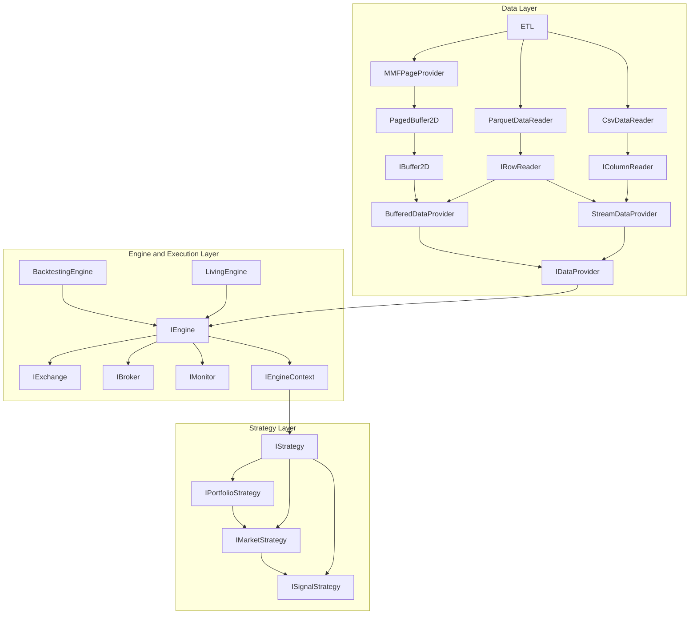

```mermaid
graph TD
    subgraph DataLayer [Data Layer]
        ETL[ETL]
        MMFPageProvider[MMFPageProvider]
        ParquetDataReader[ParquetDataReader]
        CsvDataReader[CsvDataReader]
        PagedBuffer2D[PagedBuffer2D]
        IRowReader[IRowReader]
        IColumnReader[IColumnReader]
        IBuffer2D[IBuffer2D]
        BufferedDataProvider[BufferedDataProvider]
        StreamDataProvider[StreamDataProvider]
        IDataProvider[IDataProvider]

        ETL --> MMFPageProvider
        ETL --> ParquetDataReader
        ETL --> CsvDataReader
        MMFPageProvider --> PagedBuffer2D
        ParquetDataReader --> IRowReader
        CsvDataReader --> IColumnReader
        PagedBuffer2D --> IBuffer2D
        IBuffer2D --> BufferedDataProvider
        IRowReader --> BufferedDataProvider
        IColumnReader --> StreamDataProvider
        IRowReader --> StreamDataProvider
        BufferedDataProvider --> IDataProvider
        StreamDataProvider --> IDataProvider
    end

    subgraph EngineExecutionLayer [Engine and Execution Layer]
        BacktestingEngine[BacktestingEngine]
        LivingEngine[LivingEngine]
        IEngine[IEngine]
        IEngineContext[IEngineContext]
        IExchange[IExchange]
        IBroker[IBroker]
        IMonitor[IMonitor]

        BacktestingEngine --> IEngine
        LivingEngine --> IEngine
        IDataProvider --> IEngine
        IEngine --> IExchange
        IEngine --> IBroker
        IEngine --> IMonitor
        IEngine --> IEngineContext
    end

    subgraph StrategyLayer [Strategy Layer]
        IStrategy[IStrategy]
        IPortfolioStrategy[IPortfolioStrategy]
        IMarketStrategy[IMarketStrategy]
        ISignalStrategy[ISignalStrategy]

        IEngineContext --> IStrategy
        IStrategy --> IPortfolioStrategy
        IStrategy --> IMarketStrategy
        IStrategy --> ISignalStrategy
        
        IPortfolioStrategy --> IMarketStrategy
        IMarketStrategy --> ISignalStrategy
    end
```
