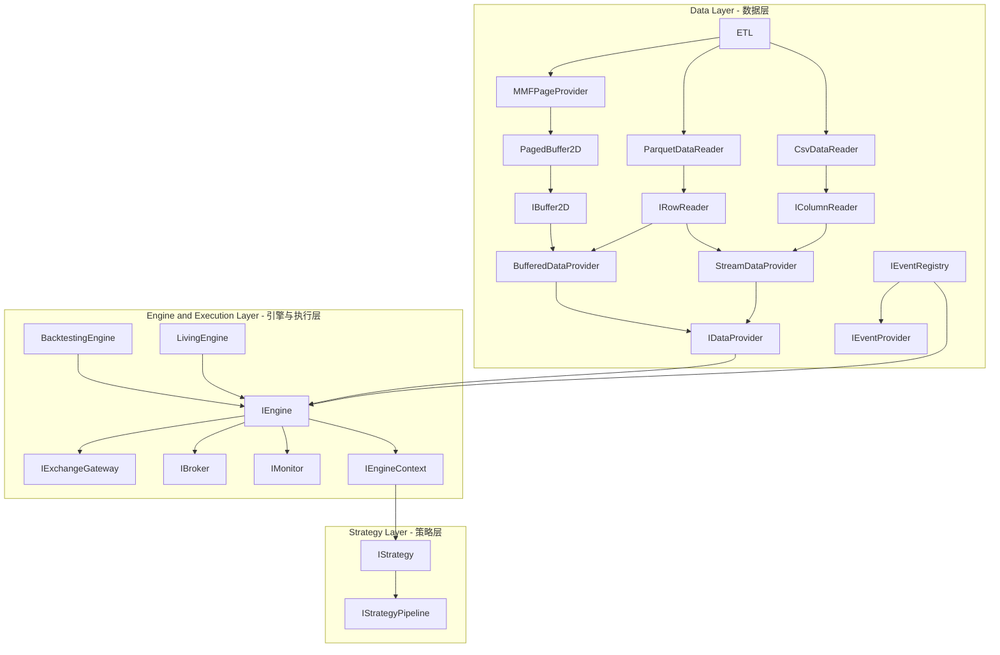

```mermaid
graph TD
    subgraph DataLayer [Data Layer - 数据层]
        ETL[ETL]
        MMFPageProvider[MMFPageProvider]
        ParquetDataReader[ParquetDataReader]
        CsvDataReader[CsvDataReader]
        PagedBuffer2D[PagedBuffer2D]
        IRowReader[IRowReader]
        IColumnReader[IColumnReader]
        IBuffer2D[IBuffer2D]
        BufferedDataProvider[BufferedDataProvider]
        StreamDataProvider[StreamDataProvider]
        IDataProvider[IDataProvider]
        IEventRegistry[IEventRegistry]
        IEventProvider[IEventProvider]

        ETL --> MMFPageProvider
        ETL --> ParquetDataReader
        ETL --> CsvDataReader
        MMFPageProvider --> PagedBuffer2D
        ParquetDataReader --> IRowReader
        CsvDataReader --> IColumnReader
        PagedBuffer2D --> IBuffer2D
        IBuffer2D --> BufferedDataProvider
        IRowReader --> BufferedDataProvider
        IColumnReader --> StreamDataProvider
        IRowReader --> StreamDataProvider
        BufferedDataProvider --> IDataProvider
        StreamDataProvider --> IDataProvider
        IEventRegistry --> IEventProvider
    end

    subgraph EngineExecutionLayer [Engine and Execution Layer - 引擎与执行层]
        BacktestingEngine[BacktestingEngine]
        LivingEngine[LivingEngine]
        IEngine[IEngine]
        IEngineContext[IEngineContext]
        IExchangeGateway[IExchangeGateway]
        IBroker[IBroker]
        IMonitor[IMonitor]

        BacktestingEngine --> IEngine
        LivingEngine --> IEngine
        IDataProvider --> IEngine
        IEventRegistry --> IEngine
        IEngine --> IExchangeGateway
        IEngine --> IBroker
        IEngine --> IMonitor
        IEngine --> IEngineContext
    end

    subgraph StrategyLayer [Strategy Layer - 策略层]
        IStrategy[IStrategy]
        IStrategyPipeline[IStrategyPipeline]

        IEngineContext --> IStrategy
        IStrategy --> IStrategyPipeline
    end
```