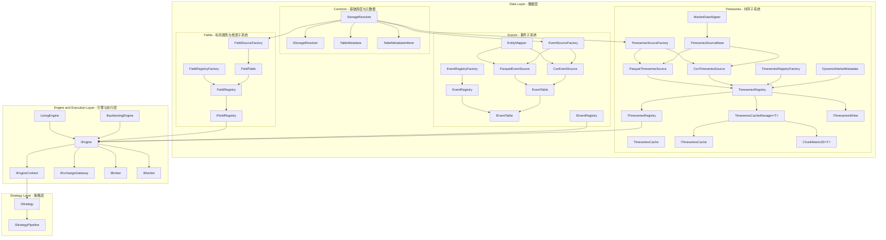

```mermaid
graph TD
    subgraph DataLayer [Data Layer - 数据层]
        subgraph Common [Common - 基础调度与元数据]
            IStorageResolver[IStorageResolver]
            TableMetadata[TableMetadata]
            TableMetadataInferer[TableMetadataInferer]
            StorageResolver[StorageResolver]

            StorageResolver --> IStorageResolver
            StorageResolver --> TableMetadata
            StorageResolver --> TableMetadataInferer
        end

        subgraph FieldsSubsystem [Fields - 标的属性与维表子系统]
            FieldSourceFactory[FieldSourceFactory]
            FieldTable[FieldTable]
            FieldRegistry[FieldRegistry]
            FieldRegistryFactory[FieldRegistryFactory]
            IFieldRegistry[IFieldRegistry]

            FieldSourceFactory --> FieldTable
            FieldTable --> FieldRegistry
            FieldRegistryFactory --> FieldRegistry
            FieldRegistry --> IFieldRegistry
        end

        subgraph TimeseriesSubsystem [Timeseries - 时序子系统]
            TimeseriesSourceBase[TimeseriesSourceBase]
            CsvTimeseriesSource[CsvTimeseriesSource]
            ParquetTimeseriesSource[ParquetTimeseriesSource]
            TimeseriesSourceFactory[TimeseriesSourceFactory]
            MarketDataAligner[MarketDataAligner]
            DynamicMarketMetadata[DynamicMarketMetadata]
            TimeseriesCache[TimeseriesCache]
            TimeseriesCacheManager[TimeseriesCacheManager&lt;T&gt;]
            ITimeseriesCache[ITimeseriesCache]
            ChunkMatrix2D[ChunkMatrix2D&lt;T&gt;]
            TimeseriesRegistry[TimeseriesRegistry]
            TimeseriesRegistryFactory[TimeseriesRegistryFactory]
            ITimeseriesRegistry[ITimeseriesRegistry]
            ITimeseriesWriter[ITimeseriesWriter]

            TimeseriesSourceBase --> CsvTimeseriesSource
            TimeseriesSourceBase --> ParquetTimeseriesSource
            MarketDataAligner --> TimeseriesSourceBase
            DynamicMarketMetadata --> TimeseriesRegistry
            TimeseriesSourceFactory --> CsvTimeseriesSource
            TimeseriesSourceFactory --> ParquetTimeseriesSource
            TimeseriesRegistryFactory --> TimeseriesRegistry
            CsvTimeseriesSource --> TimeseriesRegistry
            ParquetTimeseriesSource --> TimeseriesRegistry
            TimeseriesRegistry --> TimeseriesCacheManager
            TimeseriesCacheManager --> ITimeseriesCache
            TimeseriesCacheManager --> ChunkMatrix2D
            TimeseriesRegistry --> ITimeseriesRegistry
            TimeseriesRegistry --> ITimeseriesWriter
        end

        subgraph EventsSubsystem [Events - 事件子系统]
            EventSourceFactory[EventSourceFactory]
            CsvEventSource[CsvEventSource]
            ParquetEventSource[ParquetEventSource]
            EntityMapper[EntityMapper]
            EventTable[EventTable]
            EventRegistry[EventRegistry]
            EventRegistryFactory[EventRegistryFactory]
            IEventTable[IEventTable]
            IEventRegistry[IEventRegistry]

            EventSourceFactory --> CsvEventSource
            EventSourceFactory --> ParquetEventSource
            EntityMapper --> CsvEventSource
            EntityMapper --> ParquetEventSource
            CsvEventSource --> EventTable
            ParquetEventSource --> EventTable
            EventTable --> IEventTable
            EventRegistry --> IEventTable
            EventRegistryFactory --> EventRegistry
        end

        StorageResolver --> TimeseriesSourceFactory
        StorageResolver --> EventSourceFactory
        StorageResolver --> FieldSourceFactory
    end

    subgraph EngineExecutionLayer [Engine and Execution Layer - 引擎与执行层]
        BacktestingEngine[BacktestingEngine]
        LivingEngine[LivingEngine]
        IEngine[IEngine]
        IEngineContext[IEngineContext]
        IExchangeGateway[IExchangeGateway]
        IBroker[IBroker]
        IMonitor[IMonitor]

        BacktestingEngine --> IEngine
        LivingEngine --> IEngine
        ITimeseriesRegistry --> IEngine
        IEventRegistry --> IEngine
        IFieldRegistry --> IEngine
        IEngine --> IExchangeGateway
        IEngine --> IBroker
        IEngine --> IMonitor
        IEngine --> IEngineContext
    end

    subgraph StrategyLayer [Strategy Layer - 策略层]
        IStrategy[IStrategy]
        IStrategyPipeline[IStrategyPipeline]

        IEngineContext --> IStrategy
        IStrategy --> IStrategyPipeline
    end
```
