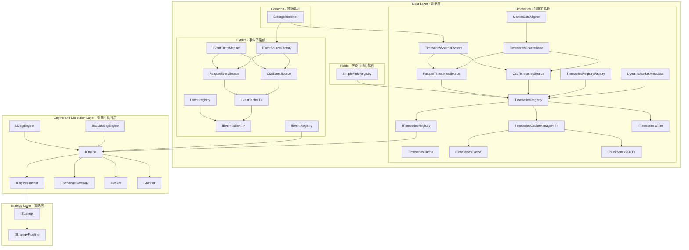

```mermaid
graph TD
    subgraph DataLayer [Data Layer - 数据层]
        subgraph Common [Common - 基础寻址]
            StorageResolver[StorageResolver]
        end

        subgraph FieldsSubsystem [Fields - 字段与标的属性]
            SimpleFieldRegistry[SimpleFieldRegistry]
        end

        subgraph TimeseriesSubsystem [Timeseries - 时序子系统]
            TimeseriesSourceBase[TimeseriesSourceBase]
            CsvTimeseriesSource[CsvTimeseriesSource]
            ParquetTimeseriesSource[ParquetTimeseriesSource]
            TimeseriesSourceFactory[TimeseriesSourceFactory]
            MarketDataAligner[MarketDataAligner]
            DynamicMarketMetadata[DynamicMarketMetadata]
            TimeseriesCache[TimeseriesCache]
            TimeseriesCacheManager[TimeseriesCacheManager&lt;T&gt;]
            ITimeseriesCache[ITimeseriesCache]
            ChunkMatrix2D[ChunkMatrix2D&lt;T&gt;]
            TimeseriesRegistry[TimeseriesRegistry]
            TimeseriesRegistryFactory[TimeseriesRegistryFactory]
            ITimeseriesRegistry[ITimeseriesRegistry]
            ITimeseriesWriter[ITimeseriesWriter]

            TimeseriesSourceBase --> CsvTimeseriesSource
            TimeseriesSourceBase --> ParquetTimeseriesSource
            MarketDataAligner --> TimeseriesSourceBase
            DynamicMarketMetadata --> TimeseriesRegistry
            TimeseriesSourceFactory --> CsvTimeseriesSource
            TimeseriesSourceFactory --> ParquetTimeseriesSource
            TimeseriesRegistryFactory --> TimeseriesRegistry
            CsvTimeseriesSource --> TimeseriesRegistry
            ParquetTimeseriesSource --> TimeseriesRegistry
            TimeseriesRegistry --> TimeseriesCacheManager
            TimeseriesCacheManager --> ITimeseriesCache
            TimeseriesCacheManager --> ChunkMatrix2D
            TimeseriesRegistry --> ITimeseriesRegistry
            TimeseriesRegistry --> ITimeseriesWriter
        end

        subgraph EventsSubsystem [Events - 事件子系统]
            EventSourceFactory[EventSourceFactory]
            CsvEventSource[CsvEventSource]
            ParquetEventSource[ParquetEventSource]
            EventEntityMapper[EventEntityMapper]
            EventTable[EventTable&lt;T&gt;]
            EventRegistry[EventRegistry]
            IEventTable[IEventTable&lt;T&gt;]
            IEventRegistry[IEventRegistry]

            EventSourceFactory --> CsvEventSource
            EventSourceFactory --> ParquetEventSource
            EventEntityMapper --> CsvEventSource
            EventEntityMapper --> ParquetEventSource
            CsvEventSource --> EventTable
            ParquetEventSource --> EventTable
            EventTable --> IEventTable
            EventRegistry --> IEventTable
        end

        StorageResolver --> TimeseriesSourceFactory
        StorageResolver --> EventSourceFactory
        SimpleFieldRegistry --> TimeseriesRegistry
    end

    subgraph EngineExecutionLayer [Engine and Execution Layer - 引擎与执行层]
        BacktestingEngine[BacktestingEngine]
        LivingEngine[LivingEngine]
        IEngine[IEngine]
        IEngineContext[IEngineContext]
        IExchangeGateway[IExchangeGateway]
        IBroker[IBroker]
        IMonitor[IMonitor]

        BacktestingEngine --> IEngine
        LivingEngine --> IEngine
        ITimeseriesRegistry --> IEngine
        IEventRegistry --> IEngine
        IEngine --> IExchangeGateway
        IEngine --> IBroker
        IEngine --> IMonitor
        IEngine --> IEngineContext
    end

    subgraph StrategyLayer [Strategy Layer - 策略层]
        IStrategy[IStrategy]
        IStrategyPipeline[IStrategyPipeline]

        IEngineContext --> IStrategy
        IStrategy --> IStrategyPipeline
    end
```
