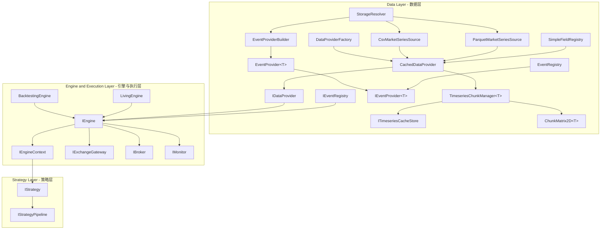

```mermaid
graph TD
    subgraph DataLayer [Data Layer - 数据层]
        StorageResolver[StorageResolver]
        CsvMarketSeriesSource[CsvMarketSeriesSource]
        ParquetMarketSeriesSource[ParquetMarketSeriesSource]
        SimpleFieldRegistry[SimpleFieldRegistry]
        DataProviderFactory[DataProviderFactory]
        CachedDataProvider[CachedDataProvider]
        TimeseriesChunkManager[TimeseriesChunkManager&lt;T&gt;]
        ITimeseriesCacheStore[ITimeseriesCacheStore]
        ChunkMatrix2D[ChunkMatrix2D&lt;T&gt;]
        IDataProvider[IDataProvider]
        EventProvider[EventProvider&lt;T&gt;]
        EventProviderBuilder[EventProviderBuilder]
        EventRegistry[EventRegistry]
        IEventProvider[IEventProvider&lt;T&gt;]
        IEventRegistry[IEventRegistry]

        StorageResolver --> CsvMarketSeriesSource
        StorageResolver --> ParquetMarketSeriesSource
        DataProviderFactory --> CachedDataProvider
        CsvMarketSeriesSource --> CachedDataProvider
        ParquetMarketSeriesSource --> CachedDataProvider
        SimpleFieldRegistry --> CachedDataProvider
        CachedDataProvider --> TimeseriesChunkManager
        TimeseriesChunkManager --> ITimeseriesCacheStore
        TimeseriesChunkManager --> ChunkMatrix2D
        CachedDataProvider --> IDataProvider
        StorageResolver --> EventProviderBuilder
        EventProviderBuilder --> EventProvider
        EventProvider --> IEventProvider
        EventRegistry --> IEventProvider
    end

    subgraph EngineExecutionLayer [Engine and Execution Layer - 引擎与执行层]
        BacktestingEngine[BacktestingEngine]
        LivingEngine[LivingEngine]
        IEngine[IEngine]
        IEngineContext[IEngineContext]
        IExchangeGateway[IExchangeGateway]
        IBroker[IBroker]
        IMonitor[IMonitor]

        BacktestingEngine --> IEngine
        LivingEngine --> IEngine
        IDataProvider --> IEngine
        IEventRegistry --> IEngine
        IEngine --> IExchangeGateway
        IEngine --> IBroker
        IEngine --> IMonitor
        IEngine --> IEngineContext
    end

    subgraph StrategyLayer [Strategy Layer - 策略层]
        IStrategy[IStrategy]
        IStrategyPipeline[IStrategyPipeline]

        IEngineContext --> IStrategy
        IStrategy --> IStrategyPipeline
    end
```
